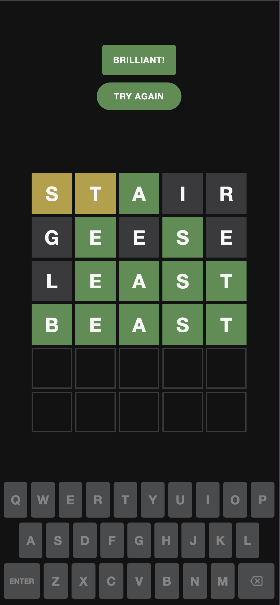

# Not Wordle

A Wordle-style word game built with Next.js. Guess the hidden five-letter word in six tries — a new random word every game.

**Play it:** [notwordle.app](https://notwordle.app)



## Features

- Type with your physical keyboard or the on-screen keyboard
- Tile colors handle repeated letters the same way Wordle does
- "Not enough letters" warning with a row shake when you submit early
- Win and lose messages, with a button to start a new game
- Current row is highlighted, and tiles pop as you type
- Animations turn off for people with "Reduce motion" enabled
- Works with screen readers: the board, rows and tiles are labeled, and each tile says whether its letter is correct, present or absent
- Link-preview image and app icons when the link is shared

## Tech stack

- [Next.js 16](https://nextjs.org) (App Router)
- React 19.2 with the [React Compiler](https://react.dev/learn/react-compiler)
- TypeScript (strict mode)
- Tailwind CSS v4 for page layout, CSS Modules for component styles
- [Jest](https://jestjs.io) and [React Testing Library](https://testing-library.com/docs/react-testing-library/intro/) for tests
- Deployed on [Vercel](https://vercel.com)

## How it works

### Coloring tiles in two passes

The tricky part of Wordle is repeated letters. Each letter in the answer can only be "used" once, and green matches get first pick.

For example, with the answer `REACT` and the guess `EERIE`:

| E    | E     | R      | I    | E    |
| ---- | ----- | ------ | ---- | ---- |
| gray | green | yellow | gray | gray |

The second E is green, so it claims REACT's only E. The first E is gray, even though it comes earlier.

[`calculateWordColors`](app/lib/colors.ts) handles this by counting each letter in the answer, then making two passes over the guess:

1. **Greens first:** mark every letter in the right spot, and use up one of that letter's count.
2. **Then the rest:** a letter is yellow only if its count still has some left; otherwise it's gray.

Each pass is a single loop, so it stays linear rather than comparing every letter against every other letter.

### Derived state

The game stores only three things: the answer, the submitted guesses, and the guess being typed. Everything else — whether you've won, whether the game is over, and each tile's color — is calculated from those on every render. There's no separate `winner` or `colors` state that could fall out of sync.

### One handler for both keyboards

The physical keyboard and the on-screen keyboard both call the same `handleKey(key)` function, so they can't behave differently. The physical keyboard listener uses React's [`useEffectEvent`](https://react.dev/reference/react/useEffectEvent), so it's added once when the game loads but always sees the latest state.

### Accessible by design

The board is built from `<div>`s, which mean nothing to a screen reader, so each layer gets a role and a name:

- The board and each row are named groups ("Game board", "Row 1" … "Row 6"), and the row you're typing in is marked with `aria-current`.
- Each tile is labeled with its letter and what its color means, like "R, present", so the result doesn't rely on color alone.
- The keyboard uses real `<button>`s, which are accessible out of the box. The icon-only Backspace key gets an `aria-label`.

## Testing

Tests find elements the way a player would: by role and label, not by CSS class. Because of this, they double as a check that the game works with a screen reader.

- **[`colors.test.ts`](app/lib/colors.test.ts)** covers the color logic, including repeated letters and greens taking priority.
- **[`Board.test.tsx`](app/_components/board/Board.test.tsx)** and **[`Keyboard.test.tsx`](app/_components/keyboard/Keyboard.test.tsx)** test each component on its own. The keyboard uses a mock function to check which key was sent.
- **[`Game.test.tsx`](app/_components/game/Game.test.tsx)** plays whole games with [user-event](https://testing-library.com/docs/user-event/intro/): typing, short-guess warnings, winning, losing and starting again. The random answer is fixed so that each test knows the word.

```bash
npm test
```

## Project structure

```
app/
  _components/
    game/            Game state and key handling
    board/           The 6×5 grid of tiles
    keyboard/        On-screen keyboard
    status-message/  Title, warnings and win/lose message
  lib/
    colors.ts        Tile color logic
    constants.ts     Board size and word list
  layout.tsx         Page metadata
  icon.svg, apple-icon.tsx, opengraph-image.tsx   Icons and share image
  **/*.test.ts(x)    Tests, next to the code they test
```

## Running locally

```bash
npm install
npm run dev
```

Then open [http://localhost:3000](http://localhost:3000).

## Roadmap

- Check guesses on the server, so the answer never reaches the browser
- Save game results to a database
- Accounts, with stats like win rate and streaks
- Color the on-screen keyboard keys as letters are revealed
- Flip animation when a guess is submitted

## Disclaimer

Not affiliated with The New York Times. Wordle is a trademark of The New York Times Company.
